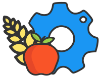
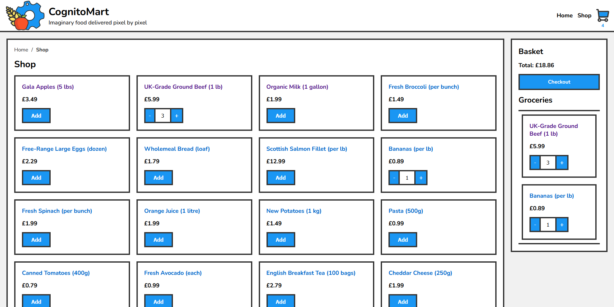

# CognitoMart (A Technical Assessment)

This is a Cognito Education technical assessment submission by Gav de Ste Croix.

[Style guide](./client/src/styles/StyleGuide.md) for global styles.

## Technologies

### Routing/Framework

As SSR (Server-Side Rendering) was not preferred in the brief, React Router has been chosen over Next.js.

### Bundler

While I typically use Parcel2 for personal projects, its instability across different machines led me to choose Vite for this project.

Note: There is a network-hosted development mode for testing on mobile devices. Ensure that port 1234 is allowed through your firewall.

### JS vs TypeScript

This choice reflects personal preference; I've used TypeScript because I frequently switch between JavaScript and C#, and TypeScript's type system aids in maintaining clarity.

### State management

I chose Valtio for state management over using React contexts because the state needed to be held at a root level. Components nested within a context re-render when the state changes, whereas Valtio has protections against this.

Although the current application is small and a context provider could have been sufficient without significantly impacting performance, Valtio's proxy-based state management becomes increasingly advantageous as the application scales.

## Design

### Fonts and colours

Fonts and colours have been copied from the Cognito Education main website.

### Logo

The logo is an animated SVG created from the Cognito logo.

Note: Feel free to keep the vector cogs.

### Page design

Page design has been inspired from a few sources:

- The basket sidebar has been inspired by Tesco.
- The product pages are inspired by Sainsburys.
- The basket page is inspired by Amazon.

#### Structure

Pages:
- Home
- Shop
- Product
- Basket
- 404

There is a link to the checkout, but it should 404.

All other pages have been considered out of scope.

### Objects and Schemas

A major design choice with the object structure is to use 'Map' over 'object' or 'Array' for the basket and the product data.

This choice aligns with the need for a hash map, given that products have unique Ids. I also require one source
of truth for the product data, so they need to be handled by Id and not reference. Handling by reference could lead to issues with basket serialisation if product data becomes stale.

I chose 'Map' over a 'Record' (object) for several reasons:

1) Products have numeric Ids starting at 1. Objects only support string keys.
2) 'Map' reliably preserves the order of entries, unlike objects.
3) Serialising basket entries for session storage requires using product Ids rather than references.
4) Valtio provides 'proxyMap', which allows updates to be detected as state changes.
5) 'Map' consumes less memory than objects.
6) The basket should display entries in a first-in, first-out order.
7) 'Map' offers better performance for insertion, deletion, and iteration than objects.
8) The initial keys are unknown (pre-fetch).

issues:

1) 'Map' does not serialise to json by default, so requires a restorer and reviver.
2) Valtio 'proxyMap' does not always work seamlessly when returning objects, so spreading is required for proper consumption.
3) Both 'Record' and 'Map' require spreading to be rendered in React.

### Components

There are instances where development time could have been accelerated by using a third party component.
I considered this outside the scope of a technical assessment and chose to make all of the components by hand.

## Testing

I have used Jest for testing the application. In addition to testing the primary component required for the task, I have also included tests for a hook to demonstrate how Valtio state can be mocked and tested, as well as for the utility functions and state actions.

Storybook has been used to develop and visualise components that are conditionally visible. However, the latest versions of Storybook have faced installation issues with certain package managers, specifically when not using Yarn. To avoid potential conflicts and ensure a smooth installation process, I have opted to exclude Storybook from the project files. This decision helps to maintain consistency with package management and reduces the risk of installation problems.

Ideally, most of the components would be added to Storybook for visual testing.

Note: there is a delay utility function included for the fetch so that latency can be simulated.

## Errors

### Fetch

Fetch errors are caught using a try/catch block and reported with console.error(). The fetch response is validated against a Zod schema, and an error is thrown if the schema validation fails. While this could be handled on a per-product basis with a loop, I have opted to treat the entire response as an array for simplicity.

Components are designed to fail gracefully if the fetch operation fails. In such cases, the returned promise resolves the Valtio state into an empty Map.

### Page errors

404 errors are handled with a catch-all directive in React Router. However, this approach does not allow for serving 404 HTTP headers, which is not ideal.

All other page errors should be managed by their respective nested error handlers.

### Stale product handling

I've implemented a very simple (crude) stale product handle to remove stale products from the basket if not returned from the fetch. If the product fetch fails, the basket quantities are preserved in session regardless.

## Improvements

Finally, here is a small list of improvements (within the project structure).

These are all things I've either assumed as out-of-scope or did not have enough time to fully implement.

### Meta data

Since the products aren't provided with meta data, I've considered page meta to be out of scope. In a production environment, I would consider using either server-side rendering (SSR) with a framework like Next.js or React-Helmet to manage and update the page meta data.

### Pretty urls

The product detail page URLs are currently constructed and retrieved using the provided product IDs. For better SEO, these URLs would be more effective if they utilised product names. This would require saving product slugs in the state for reference.

### Lazy images

If the products included images (or if I had created some), it would be beneficial to lazy load them. In Next.js, this feature comes as a default component. For my client-side implementation, I could have used a library or created a custom Lazy component to handle image loading with suspense.

Creating a component for this would also allow for pre-sizing to prevent cumulative layout shift. However, since the site has so few images, I considered this out of scope.

### Product search

The site would benefit from adding a product or site search feature in the main header. This search functionality should include features like lookahead, debouncing, and a dropdown with search suggestions and links.

### Product filters, Favourites & Pagination

Expanding the product features to include filters, favorites, and pagination would greatly enhance navigation, searchability, and overall performance.

### In-lined css for page structure

Identifying key CSS for the structure and moving it above the fold through code-splitting would improve performance by preventing flashes of un-styled content and minimising cumulative layout shift. This would result in a more visually stable user experience.

### Hard-coded text values to language/json files

Moving any hard-coded content to text or language files would make the site more customisable and easier to maintain.

### Improved Stale object handling

Improving the fetch mechanism by asynchronously checking and updating stale results would be beneficial. The basket could then be updated to reflect products that may no longer exist or that have changed in price or availability.